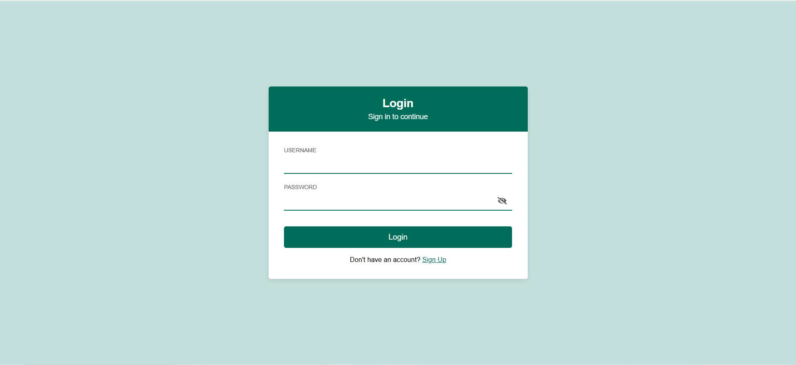
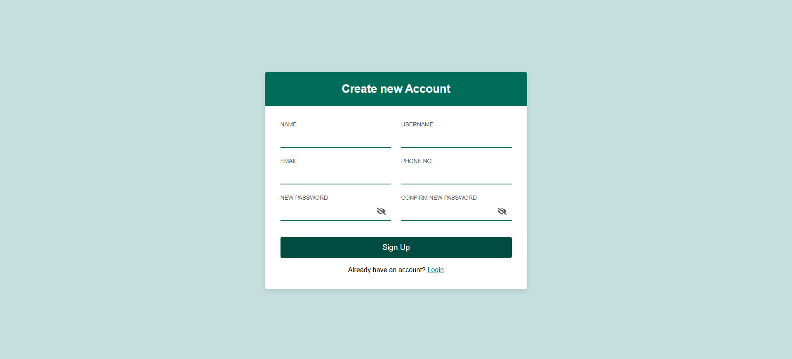
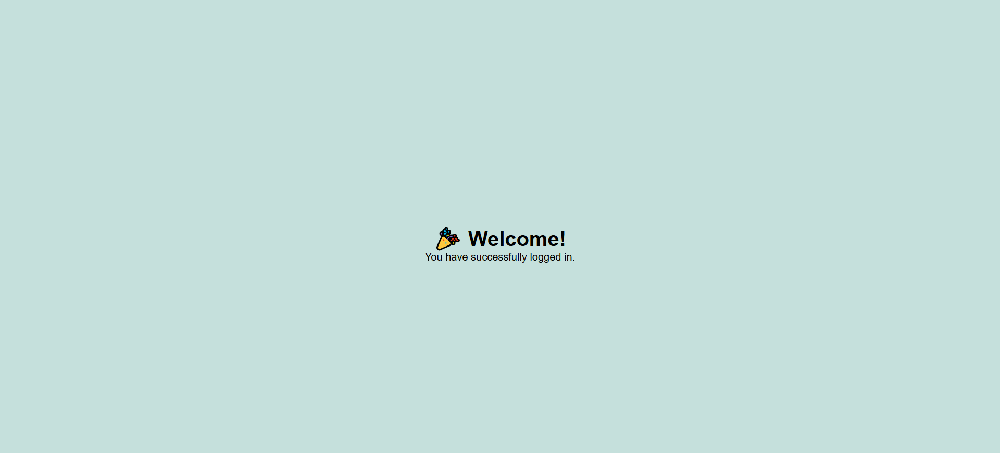

# React Assignment - Login & Signup Application

This project is a **Login and Signup React Application** built as part of the assignment.  
It demonstrates concepts of **React functional components, routing, validation, reusable UI, and responsive design**.

---

## 🚀 Features
- **Login and Signup Screens** implemented exactly as per assignment figures.
- **Routing**:
  - From Login → Signup → back to Login.
  - After successful login → Welcome page.
- **Validations** for all input fields:
  - **Name** → only alphabets allowed.
  - **Username** → alphanumeric values with special characters.
  - **Password** → must follow same rules as username but cannot be same as username.
  - **Confirm Password** → must match password.
  - **Email** → must be a valid Gmail address.
  - **Phone** → must include country code and phone number (e.g. `+91XXXXXXXXXX`).
- **Error messages** shown below each input field if validation fails.
- **Password fields** include an **eye icon** to toggle visibility (show/hide).
- **Reusable components** (`InputField`) to avoid duplicate code.
- **Responsive design**:
  - Desktop → Signup screen uses two-column layout.
  - Mobile → fields stack into single column for better usability.

---

## 🛠️ Tech Stack
- **React (Vite)** → for fast development and bundling.
- **React Router DOM** → for navigation between Login, Signup, and Welcome pages.
- **React Icons** → for the eye toggle icons in password fields.
- **CSS** → custom responsive styling.

---

## 📦 Installation & Setup

Follow these steps to set up and run the project locally:

### 1. Clone the repository
```bash
git clone <repo-link>
cd <project-folder>
```

### 2. Install dependencies
```bash
npm install
```

### 3. Start development server
```bash
npm run dev
```

Your app will be running at:
```
http://localhost:5173
```

---

## 📦 Build for Production
To generate a production build:
```bash
npm run build
```

The optimized static files will be created inside the `dist/` folder.

To preview the production build locally:
```bash
npm run preview
```

## 📸 Screenshots

### Login Screen


### Signup Screen


### Welcome Page


## 📑 Assignment Requirements Coverage
✔️ Created React app using Vite (faster alternative to create-react-app).  
✔️ Implemented **Login and Signup screens** with exact design.  
✔️ Added **routing** between Login → Signup → Login.  
✔️ After successful login, redirect to **Welcome page**.  
✔️ **Validation applied** to all fields with error messages.  
✔️ **Responsive UI** for desktop and mobile.  
✔️ **Reusable components** used for cleaner code.  
✔️ Styled to **match assignment screenshots exactly**.  

---

## 👨‍💻 Author
- Developer: Keshav 
- Assignment: **Frontend Developer Task – Login & Signup Application**  
